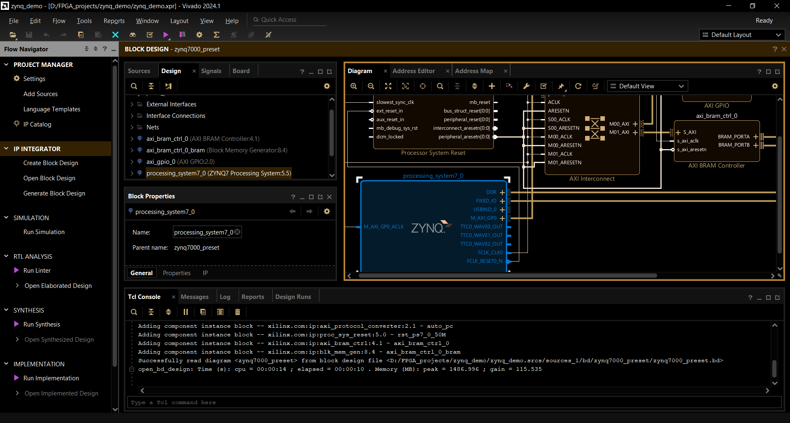

# Vivado Dark Mode

> [!WARNING]  
> This is demo code to show dark mode for any light mode application on Windows is possible, the code is not polished for a final product and the current code does not handle all edge cases.

This will eventually become a program to make any windows application dark mode, stay tuned.

This demo uses the Windows magnification API to invert a window and make it dark mode.

## Bugs/Notes

- When switching windows, it will momentarily flash. This is because of some latency in handling the window foreground event, I am not sure if it is possible to improve on this to make it less noticeable.
- Window title is hardcoded, meaning if the dark mode program was started after the window title does not match "Vivado 24.1" (for example after opening a project) it will fail.
- Currently it just inverts the program, but the magnification API supports transformation matrices so it is possible to use a different color mapping that might be better.
- Currently this handles sub-windows (such as save dialogs) by making the magnification window have the maximum Z order. This simplifies things, but also means if another window is over the active window it too will be inverted
  - Creating magnification lenses for each window with the Z height 1 above the relavant window would fix this issue.

## License

[karna-magnification](https://github.com/perevoznyk/karna-magnification?tab=MPL-2.0-1-ov-file#readme) is licensed under the MPL 2.0. See `LICENSE_Karna.Magnification`

This demo is licensed under GPL-3.0
